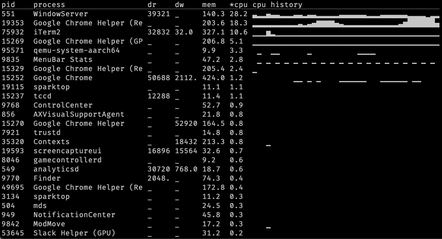

# sparktop

top, but like with sparkles ✨

top can't answer "what caused everything to be slow like 30 seconds ago?" but
sparktop can!

## wishlist 📝

- [x] per-process cpu usage history
  - instead of just showing most recent sample, can show EWMA
  - can draw sparklines ▁▂▁▄▅▄
- aggregation: group processes together by app name, or parent, by custom regex, etc
- include wait time? read/writes?
- interactions:
  - [x] sort by other values
  - show other graphs
  - show/hide columns
  - process view: show higher-res cpu, disk graphs
  - filtering
  - killing
- feature: figure out more stable ranking for "busy" processes so the list doesn't jump around as much. sorting by memory is pretty good, but also include high-cpu low-mem things.

## inspo / places to steal from

- [bottom](https://github.com/ClementTsang/bottom/blob/309ebd8dc3ba35f80c93a296ebc688813e988d03/src/lib.rs#L348)
- [zenith](https://github.com/bvaisvil/zenith/blob/master/src/metrics.rs#L387)
