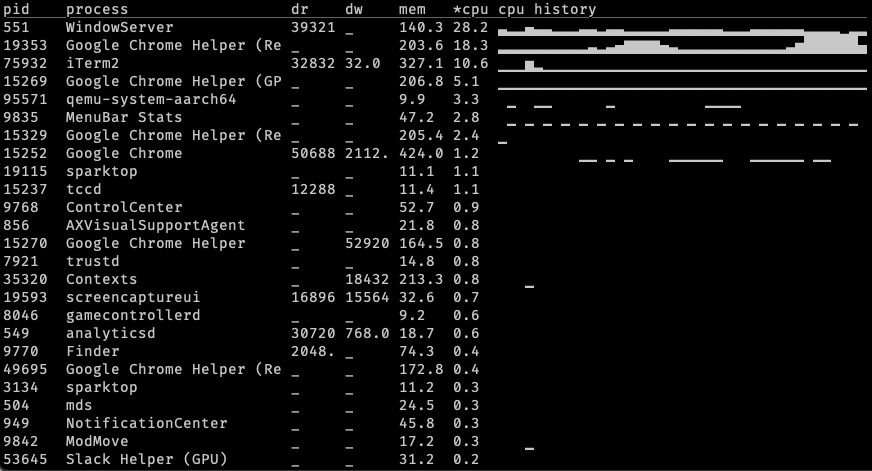

# sparktop ⚡️

top, but like with sparkles ✨

top can't answer "what caused everything to be slow like 30 seconds ago?" but
sparktop can!



## features

- [x] per-process cpu usage history
  - instead of just showing most recent sample, can show EWMA
  - can draw sparklines ▁▂▁▄▅▄
  - taller bars (`b`) give more vertical resolution; one full line = 100%, so
    multi-core (>100%) usage stacks visibly
- [x] sortable (with direction arrow), toggleable columns — default shows
  state, name, combined disk, mem, cpu; pid/user and split disk r/w are off by
  default (toggle with `c`)
- [x] numeric columns heat-shaded (green→red) by value, so high values pop
- [x] stable row order (no jitter) — only re-sorts when the active set changes;
  freshly-appeared rows briefly flash
- [x] hide idle (low-cpu) processes by default
- [x] name filter / search (`/`)
- [x] process tree view (`t`), ordered by subtree totals; pruned to active
  branches + their ancestors by default (`i` expands to the full tree)
- [x] aggregate same-named processes into one summed row (`a`)
- [x] system summary header with compact per-core usage sparklines, plus
  cpu, mem/swap, load, uptime, task count
- [x] process **detail view** (`⏎`): identity (user, ppid, state, threads,
  run-time), full **cmdline**, and full-screen high-res braille charts of a
  process's cpu, memory and disk-i/o history

## usage

```bash
cargo run                  # 1s refresh, ewma weight 0.5
cargo run -- -d 0.5 -e 0.3 # custom refresh (s) and ewma weight (0..1)
./bin/local_deploy.sh      # install setuid-root to /usr/local/bin (needed to
                           # read other users' disk i/o on macOS)
```

### keys

| key      | action                                             |
|----------|----------------------------------------------------|
| `↑`/`↓`  | move selection                                     |
| `⏎`      | open detail view for the selected process          |
| `/`      | filter by process name (type, `⏎` apply, `esc` clear) |
| `esc`    | back out of detail / clear filter / a sub-mode     |
| `s`      | choose sort column (repeat a column to reverse)    |
| `c`      | toggle which columns are shown                     |
| `i`      | show/hide idle (low-cpu) processes                 |
| `t`      | toggle process tree view                           |
| `a`      | aggregate same-named processes into one row        |
| `b`      | cycle bar height (1 → 2 → 3)                        |
| `q` / `^C` | quit                                             |

The footer always lists the keys for the current mode.

## todo

- display more stable process list
  - group stuff by sort key (perhaps deciles?) and then avoid resorting within each decile, since not that important strict ordering as much as rough neighborhood. use boxes or alternating background color
- list: toggle full/short process name
- list: other column options? user, state, ppid, threads, etc.
- tree view enhancements (basic tree done):
  - collapsable nodes, which aggregates values
  - key to fold all below certain depth
- list: regex folding
  - add regexs to create aggregation groups, expandable just like tree groups
  - name display is regex, maybe with representative match name?
- detail view: support multiple selected processes at once
- action: kill process
- process groups
  - regexs, subtrees, "selection" UI for arbitrary processes
  - can display all in detailed view, kill all, etc.
  - some notion of filtering/searching?

## inspo / places to steal from

- [bottom](https://github.com/ClementTsang/bottom/blob/309ebd8dc3ba35f80c93a296ebc688813e988d03/src/lib.rs#L348)
- [zenith](https://github.com/bvaisvil/zenith/blob/master/src/metrics.rs#L387)
- https://www.wezm.net/v2/posts/2020/rust-top-alternatives/
